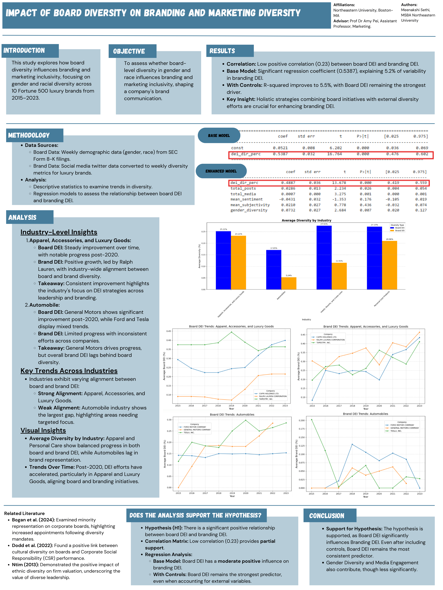

# **Impact of Board Diversity on Branding and Marketing Diversity.**

## **Research Conducted By:**
Meenakshi Sethi | Advisors: Dr. Mary Steffel and Dr. Amy Pei | Marketing Research, Northeastern University

**Dr. Mary Steffel**  
Associate Professor, Marketing; Joseph G. Riesman Research Professor, Northeastern University

**Dr. Amy Pei**  
Assistant Professor, Marketing, Northeastern University

---

## **Overview**
This repository contains tools and scripts developed for the marketing research project: **"Impact of Board Diversity on Branding and Marketing Diversity."** The study analyzed how **board-level diversity** (gender and race) influences **branding and marketing inclusivity**, covering **175 luxury brands** from **2015 to 2023**. 

---

## **Key Insights**
### **Regression Results:**
- **Base Model**:
  - R² = 0.052 (p < 0.001): Board diversity explains 5.2% of branding/marketing diversity variance.
  - A 1% increase in board diversity corresponds to a **0.54 percentage point increase** in branding/marketing inclusivity (p < 0.001).
- **Enhanced Model**:
  - R² = 0.055 (p < 0.001): Improved with factors like **gender diversity** and **media engagement**.

### **Findings**:
- **Board Diversity**: Average **23.89%**
- **Branding Inclusivity**: Average **18.08%**
- Gender diversity emerged as the most critical factor for improving branding/marketing inclusivity.

---

## **Repository Contents**
### **Scripts:**
1. **`script_SEC_Form_8K_data_processor_tool.py`**  
   - Extracts data from SEC Form 8-K PDFs to analyze board composition.
   - Saves extracted data into CSV format for downstream analysis.

2. **`data_collection_scraper.ipynb`**  
   - Scrapes branding and marketing inclusivity data from social media platforms (e.g., Twitter).

3. **`regression_analysis.ipynb`**  
   - Performs descriptive statistics, regression modeling, and visualization of trends.

---

## **Documentation**
- **`data_processor_tool_User_Guide.docx`**  
   - Instructions for setting up and running the SEC Form 8-K processor tool.

- **`data_collection_scraper_User_Guide.docx`**  
   - Guide for setting up and using the scraper tool for branding data collection.

---

## **Poster**
The **Research Poster** provides a concise summary of the project's methodology, results, and conclusions.  


---

## **Getting Started**
### **Prerequisites**
- Python 3.6+
- Install required libraries:
  ```bash
  pip install -r requirements.txt
  ```

### **Environment Variables**
Set the following variables before running the scripts:
- `OPENAI_API_KEY`: Your OpenAI API Key.
- `BASE_DIRECTORY`: Path to the directory containing input PDF files.

### **Running the Tools**
1. **SEC Data Processor Tool**:
   - Place SEC Form 8-K PDFs in subfolders under `BASE_DIRECTORY`.
   - Run the script:
     ```bash
     python script_SEC_Form_8K_data_processor_tool.py
     ```
   - Output: Extracted data saved as CSV files in the `Extracted` folder.

2. **Branding Data Scraper**:
   - Open `data_collection_scraper.ipynb` in Jupyter Notebook.
   - Follow the notebook instructions to scrape branding metrics.

3. **Regression Analysis**:
   - Open `regression_analysis.ipynb` in Jupyter Notebook.
   - Execute the notebook to generate descriptive statistics, regression models, and visualizations.

---

## **Repository Structure**
```
/board__branding_diversity_analysis/
|-- script_SEC_Form_8K_data_processor_tool.py
|-- data_collection_scraper.ipynb
|-- regression_analysis.ipynb
|-- README.md
|-- requirements.txt
|-- MIT License.txt
|-- .gitignore
|-- Research_Poster_Meenakshi_Sethi.png
|-- /docs/
    |-- data_processor_tool_User_Guide.docx
    |-- data_collection_scraper_User_Guide.docx
```

---

## **Disclaimer**
This repository contains only tools, scripts, and documentation. **No data files or the final research paper are included** due to confidentiality and ongoing research ethics.

---

## **License**
This project is licensed under the MIT License. See `MIT License.txt` for details.
